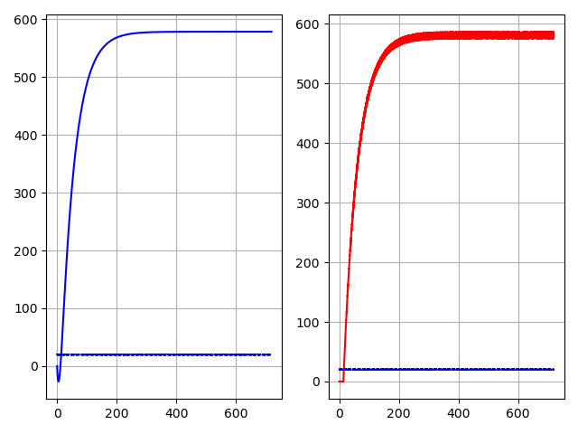

# Identificação de Sistemas e Simulação de Resposta ao Degrau

Este repositório contém um script em Python para identificação de parâmetros de sistemas dinâmicos e simulação da resposta ao degrau de um sistema de primeira ordem com atraso. A identificação é feita utilizando dois métodos clássicos: Smith e Sundaresan, e a simulação inclui a modelagem do atraso por meio de uma aproximação de Padé.

## Funcionalidades

+ Identificação de Parâmetros: O código implementa dois métodos de identificação:
  + Método de Smith: Baseado nos percentuais de 28.3% e 63.2% da resposta do sistema.
  + Método de Sundaresan: Baseado nos percentuais de 35.3% e 85.3% da resposta do sistema.
+ Simulação de Resposta ao Degrau: Após a identificação dos parâmetros, o código simula a resposta ao degrau do sistema:
  + Criação de uma função de transferência de primeira ordem.
  + Modelagem do atraso utilizando aproximação de Padé.
  + Simulação e visualização da resposta ao degrau do sistema completo.

## Estrutura do Projeto
O código segue a seguinte estrutura:

### 1. Identificação dos Parâmetros do Sistema:
+ A partir dos dados fornecidos, os parâmetros tau, theta e k são estimados pelos métodos de Smith ou Sundaresan.

### 2. Criação do Modelo:
+ Um modelo de primeira ordem é gerado com base nos parâmetros identificados.
+ O atraso é modelado utilizando a aproximação de Padé de primeira ordem.

### 3. Simulação da Resposta ao Degrau:
+ A resposta ao degrau do sistema completo (com atraso) é simulada.
+ São gerados gráficos comparando a resposta simulada com os dados reais de potência.

## Requisitos
Para rodar o script, você precisará das seguintes bibliotecas Python:
+ scipy
+ matplotlib
+ numpy
+ control

Você pode instalar estas dependências utilizando o seguinte comando:
```
pip install scipy matplotlib numpy control
```

## Como Usar
### 1. Carregar os Dados: 
O script carrega os dados de um arquivo .mat que deve conter as informações de tempo, degrau e potência.

### 2. Identificação dos Parâmetros:
Escolha um dos métodos de identificação (Smith ou Sundaresan) comentando/descomentando as linhas apropriadas:
```python
# tau, theta, k = identificacao_smith(time, potencia)
tau, theta, k = identificacao_sundaresan(time, potencia)
```
### 3. Simulação e Visualização: 
A simulação será executada automaticamente após a identificação dos parâmetros, e os gráficos das respostas ao degrau serão exibidos.

## Exemplo de Saída
Abaixo estão os gráficos gerados pela simulação da resposta ao degrau:
+ Gráfico da esquerda: Compara a resposta ao degrau do sistema modelado (linha azul) com o degrau aplicado (linha tracejada).
+ Gráfico da direita: Mostra a potência real do sistema (linha vermelha) em comparação com o degrau aplicado (linha tracejada).


## Licença
Este projeto é de código aberto e está licenciado sob a MIT License.
